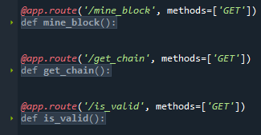

<h1>Generic Blockchain</h1> 

  
  
  

> Status do Projeto: em construção

### Tópicos 

:small_blue_diamond: [Descrição do projeto](#descrição-do-projeto)

:small_blue_diamond: [Funcionalidades](#funcionalidades)

:small_blue_diamond: [API](#API)

:small_blue_diamond: [Pré-requisitos](#pré-requisitos)

:small_blue_diamond: [Como-executar](#como-executar)

:small_blue_diamond: [Desenvolvedora](#Desenvolvedora)

## Descrição do projeto 

  Projeto criado para entender e praticar os conceitos de Blockchain, Criptomoedas e Contratos inteligentes.

## Funcionalidades

:heavy_check_mark: BLOCKCHAIN: Criar uma nova cadeia, minerar novos blocos e verificar se a blockchain é consistente.

## API

## Pré-requisitos
Todas as dependencias estão listadas no arquivo requirement.txt e podem ser baixadas com o comando: pip install -r requirements.txt

:warning: [Anaconda](https://www.anaconda.com/)

:warning: [Flask](https://flask.palletsprojects.com/en/2.1.x/)

## Como-executar:

Para rodar o projeto, siga os passos:

1 - Baixe o projeto localmente (git clone)

2 - Instale o Anaconda

3 - Crie o virtual env dentro da pasta do projeto (virtualenv venv)
 
4 - Ative o venv (Windows: venv\Scripts\activate)

5 - Instale as dependencias (pip install -r requirements.txt)

6 - Abra o arquivo principal do modulo no Anaconda/Spyder e execute na opção "Run File"

7 - Acesse o Postman e execute as requisições a partir das urls mapeadas.

## Desenvolvedora :

| [ Mayara Madeira Trevisol](https://github.com/mayara-mt) | 
|:--------------------------------------------------------------------------------------------------------------------------------------------------------------------------------------------------:|  